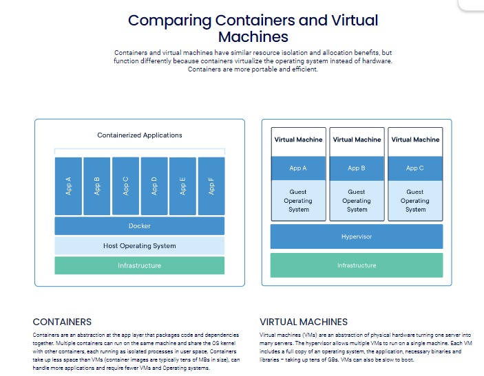

# Docker notes

Docker is a tool designed to make it easier to create, deploy, and run applications by using containers. Containers allow developers to package an application with all of its dependencies into a standardized unit for software development. This container can then be consistently run on any environment that has Docker installed, ensuring that the application works the same way regardless of where it is deployed.

## Key Points:
Containerization: Docker packages an application and its dependencies into a container, making it easy to move and run anywhere.
Consistency: Containers ensure that the application runs the same, regardless of where it's deployed, eliminating the "it works on my machine" problem.
Efficiency: Containers are lightweight and start quickly, using less resources compared to traditional virtual machines.
## How Docker Works:
Images: Docker uses images as blueprints for containers. An image includes everything needed to run an application: code, runtime, libraries, and configuration files.
Containers: Containers are running instances of images. They are isolated from each other and the host system, ensuring a consistent runtime environment.
Docker Hub: Docker Hub is an online repository where you can find and share Docker images.
## Example:
Imagine you have a web application that needs a specific version of Python and several libraries. With Docker, you can create an image that includes the exact version of Python and all required libraries. When you run this image, it creates a container that isolates your web application, ensuring it runs the same on any system with Docker installed.

In summary, Docker simplifies application deployment and management by using containers to package an application and its dependencies, ensuring consistent behavior across different environments.

Main difference between Docker and Virtual Machines :

For Docker cheatsheet 
[Referhere](https://www.docker.com/resources/cli-cheat-sheet/)

## To install Docker:
curl -fsSL https://get.docker.com -o get-docker.sh
sh get-docker.sh

sudo usermod -aG docker <username>
#exit and relogin
docker info
This command should not give any errors

### How to create container?
-it :interactive mode ,we will go into container and execute commands
-d :detached mode, it is used to run the container in background

### How to create image?

### How to pull image?

